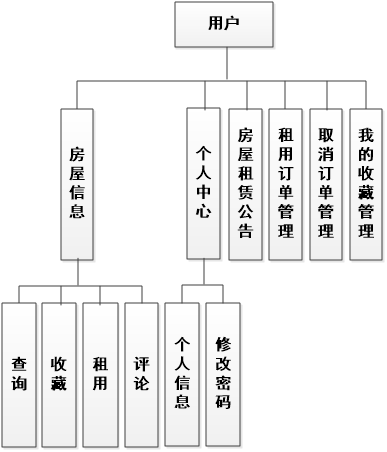

# 基于Springboot的房屋租赁管理系统

## Springboot-0080


## 技术栈

Springboot mybatisplus vue mysql maven


## 数据库表(16张)


## 功能介绍

```properties
管理员管理屋主和用户，管理房屋，租房订单，保洁，安保，房屋租赁公告等信息。

屋主管理房屋，审核租用订单，预约保洁和安保。

用户收藏房屋，租用房屋，支付租房订单。
```


## 图片

### 前台


### 后台


## 访问路径

### 前台

```properties
http://localhost:8080/springboot89nep/front/pages/login/login.html

账号 1
密码 1
```

### 后台

```properties
http://localhost:8080/springboot89nep/admin/dist/index.html#/login

账号 abo
密码 abo
```


## 功能图




## 文档目录


## 打赏或交流


